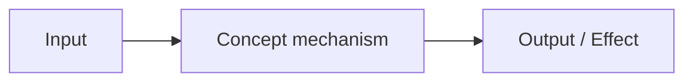

## What is [Concept]?

Write 2–4 sentences answering: *What is this? What problem does it solve? Where does it fit in OCM?*

Avoid "how to configure" or step-by-step instructions here. This section builds the mental model.

> **Example:** A resolver maps component name patterns to OCM repositories. When OCM encounters a component reference during recursive resolution, it consults the configured resolvers to locate the right repository — without requiring the caller to know where each component lives.

## Why does it exist?

Explain the design rationale. What would be harder or impossible without this concept?

Use 1–3 short paragraphs or a brief list of motivations.

- **Motivation 1:** Why this was needed
- **Motivation 2:** What alternative it replaces or improves
- **Motivation 3:** What constraint or use case it addresses

## How it works

Explain the underlying mechanics — not how to *use* it, but how it *works internally*.
Use a diagram to build a clear mental model:

Describe the diagram in 2–4 sentences. Walk through the key parts and their relationships.

### [Sub-concept or aspect A]

Explain one distinct aspect of the concept in depth. Use subsections to separate orthogonal concerns.

### [Sub-concept or aspect B]

Continue with the next aspect.


Highlight any non-obvious behavior, edge cases, or important constraints that affect how this concept works.


## Key properties

Summarize the defining characteristics that readers should remember.

| Property | Description |
|----------|-------------|
| **[Property 1]** | What it means and why it matters |
| **[Property 2]** | What it means and why it matters |
| **[Property 3]** | What it means and why it matters |

## Relationship to other concepts

Explain how this concept connects to, extends, or depends on other OCM concepts.
Keep this conceptual — link to the other concept docs instead of repeating their content.

- **[Related Concept A]()** — How they relate (e.g., "Resolvers depend on OCM Repositories as their resolution targets")
- **[Related Concept B]()** — How they relate

## When to use it

Describe the scenarios in which this concept is relevant. Help readers recognize *when* they are dealing with this concept.

- Use **[Concept]** when you need to…
- It becomes important when…
- You can ignore it if…


If this concept has common misconceptions, address them here briefly.


## Next steps

- [How-to: <name>]()

## Related documentation

- [Concept: <name>]()
- [Tutorial: <name>]()
- [Reference: <command>]()

---

## ✓ Before publishing

Make sure to comply with our [CONTRIBUTING guide](../CONTRIBUTING.md),
check the [Concept Writing Checklist](../CONTRIBUTING.md#concept-checklist),
and ensure the following:

- [ ] Title is a noun or noun phrase — not a verb or task (e.g., "Resolvers", not "How to use resolvers")
- [ ] Description answers "what is it and why does it matter"
- [ ] No step-by-step instructions — link to How-tos or Tutorials instead
- [ ] Explains *why* the concept exists, not just *what* it is
- [ ] Uses a diagram to build a mental model (Mermaid preferred)
- [ ] Subsections address distinct orthogonal aspects
- [ ] "Relationship to other concepts" section with relref links
- [ ] "When to use it" section helps readers self-identify relevance
- [ ] No CLI commands that constitute a workflow (short illustrative snippets are OK)
- [ ] Working `relref` links throughout
