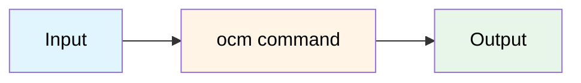

## Goal

One sentence: what you will achieve.

## You'll end up with

- A concrete outcome (artifact/config/state)
- A verifiable success condition

**Estimated time:** ~X minutes

## Workflow (optional)

Include a diagram only if it clarifies the process. Keep it simple (3–5 nodes max).



One sentence explaining what this diagram shows.

See [Diagram Color Guide]() for consistent styling across all documentation.

## Prerequisites

- [OCM CLI]() installed
- Access to the required repository/service
- Required credentials/keys available


⚠️ **Preconditions:** Mention anything that would cause data loss or unexpected changes.


## Steps

1. **Do the first thing**

   Brief explanation (1–2 sentences max). Link to concepts for "why"—don't explain inline.

   ```bash
   ocm <command> <args>
   ```

   
   **Handling variants:** If your how-to covers multiple approaches or platforms, use tabs to show alternatives:

   
   
   ```bash
   ocm sign cv --private-key private.key
   ```
   
   
   ```bash
   ocm sign cv --sigstore
   ```
   
   
   

   You should see: `[specific success indicator]`.

   <details>
     <summary>Output</summary>

   ```text
   ...
   ```
   </details>

2. **Do the next thing**

   If needed, show the minimal config:

   ```yaml
   # Key fields only
   key: value
   required: field
   ```

3. **Verify**

   Show the shortest check that proves success:

   ```bash
   ocm <command> --check
   ```

   You should see: `[expected output]`. This confirms your setup is correct.

   <details>
     <summary>Expected output</summary>

   ```text
   OK ...
   ```
   </details>

## Troubleshooting

### Symptom: [Specific error message]

**Cause:** One sentence explaining why.

**Fix:**

```bash
# Fix command
...
```

### Symptom: [Another issue]

**Cause:** ...

**Fix:** ...

### Getting help

If these solutions don't work:

- [OCM Troubleshooting Guide]()
- [Community Support](link)
- [Open an Issue](https://github.com/open-component-model/ocm/issues)

## Cleanup (optional)

Remove resources created:

```bash
# Cleanup commands
...
```


⚠️ This will delete [what will be deleted].


## Next steps

- [How-to: <name>]()

## Related documentation

- [Concept: <name>]()
- [Tutorial: <name>]()
- [Reference: <command>]()

---

## ✓ Before publishing

Make sure to comply to our [CONTRIBUTING guide](../CONTRIBUTING.md),
check the [Tutorial Writing Checklist](../CONTRIBUTING.md#how-to-guide-checklist),
and ensure the following:

- [ ] Title starts with "How to..." or action verb (Configure/Deploy/Create/...)
- [ ] States the goal in the first paragraph
- [ ] Realistic time estimate
- [ ] Simple numbered lists (use `` only if 3+ complex steps)
- [ ] Success indicators after each step
- [ ] Links to concepts (never inline "why" explanations)
- [ ] Use `` for variants (different approaches, platforms, configurations)
- [ ] Troubleshooting with symptom-cause-fix
- [ ] Working relref links
